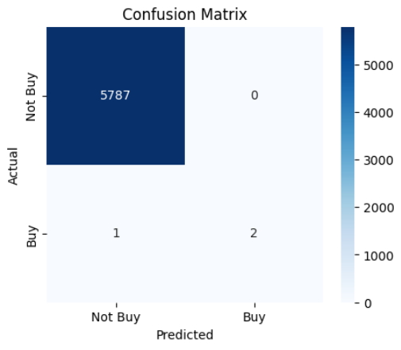
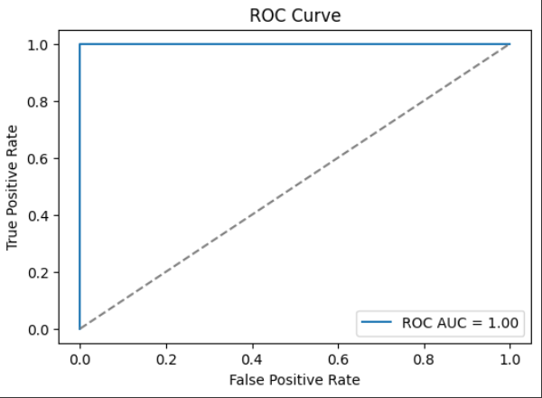
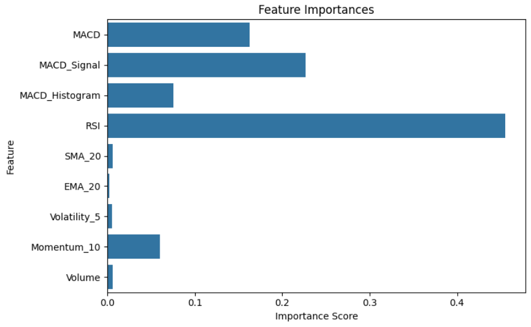

# Nifty50 Algo Trading Strategy

An end-to-end algorithmic trading project built using Python. This project demonstrates technical analysis, strategy design, backtesting, and performance evaluation, designed with a strong focus on analytical and coding skills applicable to quantitative finance roles like Barclays Global Markets & Equity Research.

---

## Project Overview

This project explores the development of rule-based trading strategies using technical indicators (MACD, RSI, SMA). We work with historical stock data of the Nifty50 constituents (India’s benchmark index), clean and engineer features, implement strategies, backtest them, and analyze risk-adjusted returns.

---

## Core Objectives

- Apply financial technical analysis to historical equity data
- Engineer indicators (MACD, RSI, SMA-20/50, Bollinger Bands)
- Build modular trading logic in Python using signal rules
- Backtest across 20+ Nifty stocks from 2018–2023
- Evaluate the Sharpe ratio, drawdown, and total return
- Visualise portfolio performance

---

## Tech Stack

- Python (Pandas, NumPy, Matplotlib, TA-Lib / `ta`)
- Jupyter Notebooks
- Yahoo Finance API via `yfinance`
- Modularised strategy functions
- Google Colab & GitHub

---

## 📁 Folder Structure

```bash 
nifty50-algo-trading-strategy/ 
├── data/
│     ├── Cleaned_Nifty50_Data.csv
│     ├── nifty50_data.csv
│     └── nifty50_features.csv
├── notebooks/
│     ├── 01_data_collection.ipynb
│     ├── 02_feature_engineering.ipynb
│     ├── 03_strategy_backtesting.ipynb
│     ├── 04_strategy_visualization.ipynb
│     └── 05_project_summary.ipynb
├── strategies/
│     └── Strategy_functions.py
├── results/
│     └── strategy_results.csv
├── Algo_trading_project.pdf
├── requirements.txt
└── README.md
```
## 🧾 File & Notebook Descriptions

| File / Folder | Description |
|---------------|-------------|
| `data/` | Contains all raw and processed datasets. |
| `Cleaned_Nifty50_Data.csv` | Cleaned historical stock prices of selected Nifty50 constituents. |
| `nifty50_data.csv` | Raw downloaded stock data via Yahoo Finance. |
| `nifty50_features.csv` | Feature-engineered data including technical indicators (MACD, RSI, SMA, etc). |
| `notebooks/` | Step-by-step development of the project in Jupyter notebooks. |
| `01_data_collection.ipynb` | Downloads historical OHLCV data for Nifty50 stocks using `yfinance`. |
| `02_feature_engineering.ipynb` | Adds technical indicators (MACD, RSI, SMA20/50, Bollinger Bands) to the dataset. |
| `03_strategy_backtesting.ipynb` | Implements MACD + RSI-based trading logic, backtests strategy, and logs performance metrics. |
| `04_strategy_visualization.ipynb` | Visualises portfolio value, buy/sell signals, and overlays indicators. |
| `05_project_summary.ipynb` | High-level summary, comparisons of top-performing stocks, and final insights. |
| `06_ml_signal_classifier.ipynb` | Bonus ML notebook using Random Forest to classify Buy signals based on technical indicators. |
| `strategies/` | Python script containing reusable strategy logic. |
| `Strategy_functions.py` | Modular functions for signal generation and backtesting. |
| `results/` | Strategy backtest results saved for evaluation. |
| `strategy_results.csv` | Final output of returns, Sharpe ratio, and drawdown per stock. |
| `Algo_trading_project.pdf` | Polished PDF summarising objectives, methods, and outcomes. |
| `requirements.txt` | Lists required Python packages. |
| `README.md` | This file describes the project's purpose, setup, and structure. |


---

## Sample Strategy Logic

```python
# Buy Signal: MACD crosses above MACD Signal AND RSI below 30
df.loc[(df["MACD"] > df["MACD_Signal"]) & (df["RSI"] < 30), "Signal"] = 1

# Sell Signal: MACD crosses below MACD Signal AND RSI above 70
df.loc[(df["MACD"] < df["MACD_Signal"]) & (df["RSI"] > 70), "Signal"] = -1
```
## 🔍 Bonus: ML-Based Buy Signal Classifier

- Built a Random Forest model to classify “Buy” signals using engineered indicators
- Achieved **ROC AUC = 1.00**, handling class imbalance with **SMOTE**
- Feature set included **MACD Histogram, Volatility (5-day), Momentum (10-day)** etc.
- Provides automation for signal generation under real-world noise

### Confusion Matrix (ML Classifier)



### ROC Curve



## Feature Importance


---
## Getting Started

Clone this repo:
   ```bash
   git clone https://github.com/yourusername/nifty50-algo-trading-strategy.git
   cd nifty50-algo-trading-strategy
   pip install -r requirements.txt
   ```

---

## Project Summary

For a high-level walkthrough of the strategy performance and key insights, refer to [`05_project_summary.ipynb`](notebooks/05_project_summary.ipynb).

---

## Data Snapshot

- Time Period: Jan 2018 – Dec 2023  
- Universe: 20+ Nifty50 stocks  
- Data Points: ~30,000+ rows (OHLCV + Indicators)

---

## Author

**Yug Desai**  
yug.desai@iitgn.ac.in  
+91-9909482215  
Quantitative Finance | Python | Financial Modelling

---

## Acknowledgements

- [NSE via Yahoo Finance](https://finance.yahoo.com/) for historical data  
- [TA-Lib](https://github.com/mrjbq7/ta-lib) and [yfinance](https://github.com/ranaroussi/yfinance)  
- Annuity Capstone Winter Projects 2024 (IITGN)

---
   
