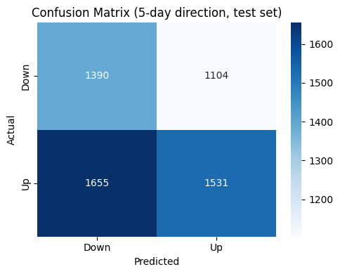
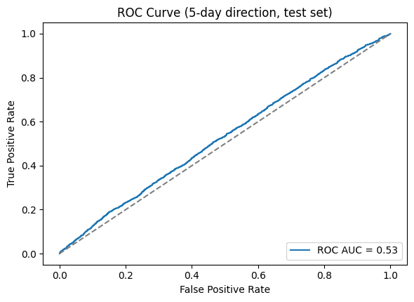
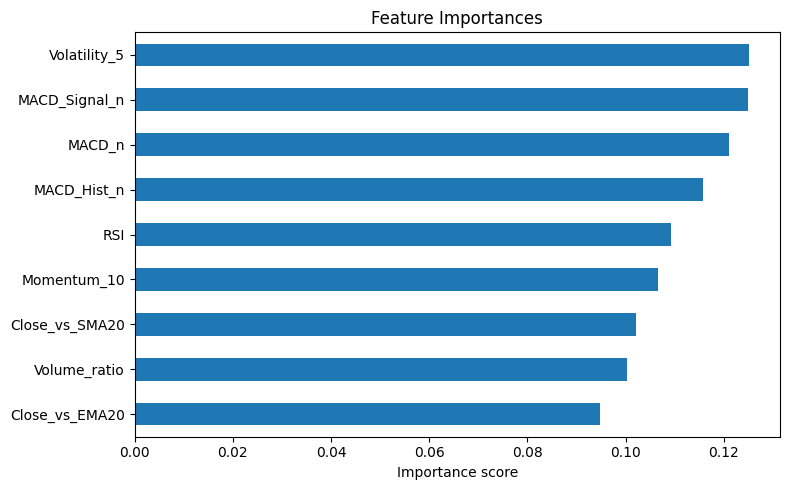

# Nifty50 Algo Trading Strategy

A Python project that backtests a long/short MACD + RSI rule on 20 large-cap NIFTY50 stocks (Jan 2018 – Dec 2023) and tests whether technical features can predict short-term returns.

---

## Key Findings

- **The rule rarely trades.** Each stock had only 0–2 position changes over six years, so each result is essentially a single directional bet.
- **It underperformed buy-and-hold.** Only 2 of 20 stocks ended with a positive return, 2 never traded and 16 lost money. It beat buy-and-hold on 1 stock (SBIN) and lost to it on 18. `BHARTIARTL.NS` (the best Sharpe, 0.73) had 0 position changes, so its result is identical to buy-and-hold.
- **ML check.** An early classifier reported AUC 1.00 because of target leakage (the label was built from its own input features). The corrected version predicts 5-day forward returns with a chronological split and reaches an out-of-sample **AUC of 0.53**, close to random.

---

## Methodology

- **Data**: daily OHLCV from Yahoo Finance via `yfinance` (adjusted prices), 20 hand-picked large caps, Jan 2018 – Dec 2023 (about 29,000 stock-day rows).
- **Indicators**: SMA-20, EMA-20, MACD, RSI, Bollinger Bands, ATR (via the `ta` library).
- **Strategy**: Buy (+1) when MACD > MACD signal and RSI < 30; Sell/short (−1) when MACD < MACD signal and RSI > 70; otherwise hold the previous position. Signals are lagged one day to avoid look-ahead bias.
- **Metrics**: final portfolio value, Sharpe ratio (annualised, no risk-free rate), maximum drawdown, and buy-and-hold return for comparison.

```python
df.loc[(df["MACD"] > df["MACD_Signal"]) & (df["RSI"] < 30), "Signal"] = 1
df.loc[(df["MACD"] < df["MACD_Signal"]) & (df["RSI"] > 70), "Signal"] = -1
```

---

## ML Experiment

- **Target**: 1 if the next 5-day return is positive.
- **Features**: scale-free ratios of MACD, RSI, SMA/EMA distance, volatility, momentum and volume, computed per ticker.
- **Split**: chronological, 80% train / 20% test, with a 10-day gap.
- **Result**: ROC AUC 0.529, accuracy 0.51 (test share of up-moves: 0.561), i.e. no reliable edge.





---

## Limitations

- No transaction costs or slippage; short positions assumed frictionless.
- Stocks are hand-picked from today's large caps (survivorship and selection bias).
- Few trades per stock, so results are not statistically meaningful.

---

## Folder Structure

```
nifty50-algo-trading-strategy/
├── data/
│   ├── Cleaned_Nifty50_Data.csv
│   ├── nifty50_data.csv
│   └── nifty50_features.csv
├── notebooks/
│   ├── 01_data_collection.ipynb
│   ├── 02_feature_engineering.ipynb
│   ├── 03_strategy_backtesting.ipynb
│   ├── 04_strategy_visualization.ipynb
│   ├── 05_project_summary.ipynb
│   └── 06_ml_signal_classifier.ipynb
├── strategies/
│   └── strategy_functions.py
├── results/
│   └── strategy_results.csv
├── Algo_trading_project.pdf
├── requirements.txt
└── README.md
```

---

## Getting Started

```bash
git clone https://github.com/Yugdes/Nifty50-Algo-Trading-Strategy.git
cd Nifty50-Algo-Trading-Strategy
pip install -r requirements.txt
```

Run the notebooks in order (01 to 06). See `notebooks/05_project_summary.ipynb` for the summary.

---

## Author

**Yug Desai** · yug.desai@iitgn.ac.in

## Acknowledgements

- Yahoo Finance data via [yfinance](https://github.com/ranaroussi/yfinance) and the [`ta`](https://github.com/bukosabino/ta) library
- Annuity – Finance Club, IIT Gandhinagar
